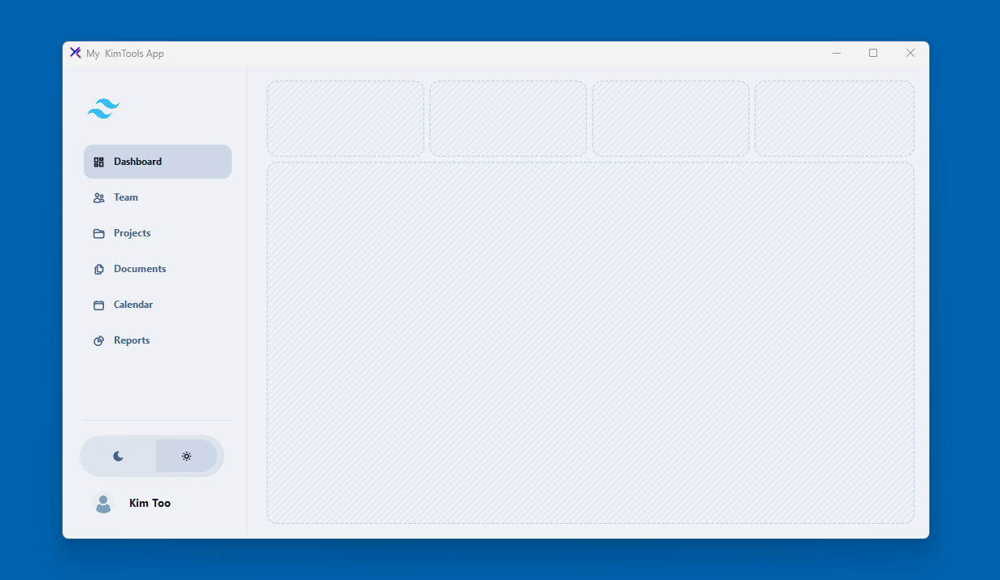
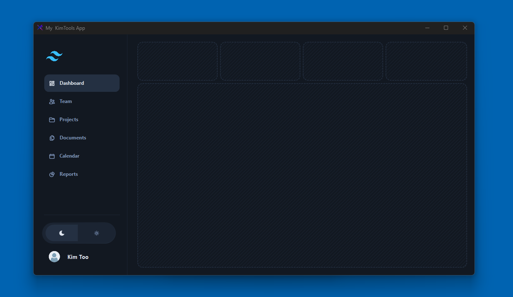

# Tailwind Application UI Dashboard Clone (Built with KimTools)

A high-performance desktop application dashboard layout cloned from the iconic **Tailwind Application UI** design framework. This project showcases a fully adaptive architecture featuring both an ultra-clean Light Mode and a seamless Dark Mode, engineered exclusively inside the **.NET ecosystem** using the **KimTools** UI toolkit.

---

## 📺 Video Walkthrough & Implementation

Watch the step-by-step showcase and code breakdown directly on YouTube:

---

## 📸 Interface Showcases

### Light Mode & Dark Mode Environments
Below are the interface previews showing the responsive sidebar navigation and data widget placeholder panels.

| ☀️ Light Mode Preview | 🌙 Dark Mode Preview |
| :---: | :---: |
|  |  |

---

## 🚀 Overview

This repository provides a structural workspace template focused on premium UI/UX fidelity. It maps out the exact structural composition of standard modern web dashboards—adapted flawlessly for high-performance desktop applications.

### Key Visual Architecture:
* **Fully Responsive Side Navigation Menu:** Fluid menu mechanics optimized for dynamic screen estates.
* **Precision-Balanced Placeholder Panels:** Structured layout containers pre-configured to handle heavy widget data and custom content feeds.
* **Dual-Themed Environment:** Native light and dark mode toggles with immediate theme reflection.

---

## 🛠️ Powered by KimTools

The underlying engine driving this entire user interface experience is **KimTools**—an elegant suite of intuitive UI controls, components, and libraries optimized for world-class developer workflows. 

### Core Platform Highlights:
* **NuGet Integration:** Completely native to the .NET package pipeline.
* **Modern Control Set:** Over 40 modern, fully customizable UI controls.
* **Design Depth:** 35+ enterprise-grade themes paired with a native Tailwind-inspired color mapping matrix.
* **Asset Library:** Access to over 10,000 precision-aligned SVG icons.
* **Advanced Mechanics:** Powered by a low-code designer editor and a high-fidelity, DPI-aware rendering engine.

---

## 🔑 Licensing Requirements

> ⚠️ **IMPORTANT NOTICE:** This repository provides the structural layout template for free. However, running the codebase and utilizing the full set of advanced UI controls requires an active **KimTools PLUS License**.

### Choosing Your Tier:
1. **KimTools Free Edition:** Features 14 core essential controls built with identical performance metrics and rendering fidelity. You can learn more or check compliance parameters directly at [kimtoo.net](https://kimtoo.net).
2. **KimTools PLUS Suite:** Required to compile and run this premium template seamlessly. Unlocks the entire enterprise component catalog, theme library, and layout frameworks.

👉 **Get Your License Here:** [KimTools Official Website](https://kimtoo.net)

---

## 📬 Contributing & Feedback

If you run into architectural bottlenecks or want to propose layout upgrades, feel free to open an issue or submit a pull request! If you find this template useful, please drop a ⭐ on this repository to support future open-source workspace releases.